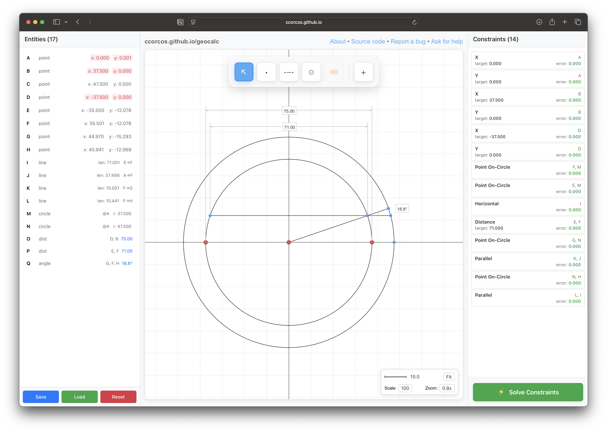
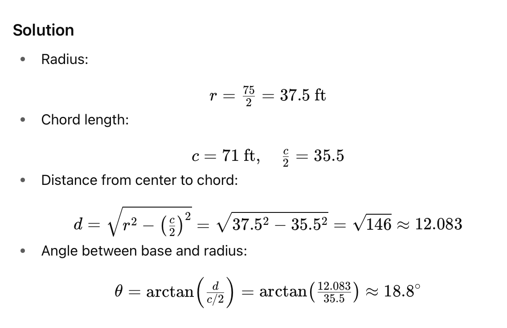

# GeoCalc - 2D Geometry Calculator

A web-based 2D CAD application that lets you draw shapes, apply constraints, and use numerical optimization to solve for the geometry that satisfies all constraints simultaneously.

## 🎯 What is GeoCalc?

GeoCalc is an interactive 2D geometry tool where you can:

- **Draw** points, lines, and circles on a canvas
- **Apply constraints** like fixed distances, parallel lines, perpendicularity
- **Solve** the constraint system using numerical optimization

Unlike traditional CAD tools that use algebraic constraint solving, GeoCalc uses a numerical gradient descent approach that's simpler to implement and extend.

## Tips and tricks

- cmd+click a point, line, or circle to constraint its position / size.
- select some shapes, then right click to add a constraint
- select some shapes, then click the label button to create a measurement label

## Motivation

About once per year or so, I find myself trying to solve a geometry problem that is incredibly tedious and error-prone to do algebraically. I also usually don't care about the algebraic solution either, I just want to know the measurement. So I made this tool.

### Example

When working on the [Rainbow Bridge](https://chetcorcos.notion.site/Rainbow-Bridge-896c341316ab4ae59064c02d948382b0) project, I recall a very annoying geometry problem:

The inside of the arch is an arc on a 75ft diameter circle. But the actual base of the arch is 71ft across. We have all these arc-shaped plywood panels, but we need to figure out the size of the wedges at the base of the arch.

[And here is the solution: 18.8°](https://ccorcos.github.io/geocalc/?state=eyJ2ZXJzaW9uIjo0LCJnZW9tZXRyeSI6eyJwb2ludHMiOltbIjIxMiIseyJpZCI6IjIxMiIsIngiOjAuMDAwMDUxNDU0NzUxOTkxMzE4NjMsInkiOjAuMDAwNjc1OTg5NTA3MjU5MzQ0MX1dLFsiMjEzIix7ImlkIjoiMjEzIiwieCI6MzcuNSwieSI6MH1dLFsiMjE1Iix7ImlkIjoiMjE1IiwieCI6NDcuNSwieSI6MH1dLFsiMjE3Iix7ImlkIjoiMjE3IiwieCI6LTM3LjUsInkiOjB9XSxbIjIyMCIseyJpZCI6IjIyMCIsIngiOi0zNS41MDAzNTA0OTQ2NzkwNiwieSI6LTEyLjA3NzkyNTE0MDUzMzQ0NX1dLFsiMjIxIix7ImlkIjoiMjIxIiwieCI6MzUuNTAwNTExMzUwMTg4NTI1LCJ5IjotMTIuMDc3NzgyOTU2OTU4MTY3fV0sWyIyMjkiLHsiaWQiOiIyMjkiLCJ4Ijo0NC45NzA0NDU3NjU4MzIzNjYsInkiOi0xNS4yOTI5NDgwNjI3ODgwMzN9XSxbIjIzMyIseyJpZCI6IjIzMyIsIngiOjQ1Ljk0MTE2MDE1NTAyODM4NSwieSI6LTEyLjA2ODU5NDQ0MjUzMTExM31dXSwibGluZXMiOltbIjIyMiIseyJpZCI6IjIyMiIsInBvaW50MUlkIjoiMjIwIiwicG9pbnQySWQiOiIyMjEifV0sWyIyMjgiLHsiaWQiOiIyMjgiLCJwb2ludDFJZCI6IjIxMiIsInBvaW50MklkIjoiMjIxIn1dLFsiMjMwIix7ImlkIjoiMjMwIiwicG9pbnQxSWQiOiIyMjEiLCJwb2ludDJJZCI6IjIyOSJ9XSxbIjIzNCIseyJpZCI6IjIzNCIsInBvaW50MUlkIjoiMjIxIiwicG9pbnQySWQiOiIyMzMifV1dLCJjaXJjbGVzIjpbWyIyMTQiLHsiaWQiOiIyMTQiLCJjZW50ZXJJZCI6IjIxMiIsInJhZGl1c1BvaW50SWQiOiIyMTMifV0sWyIyMTYiLHsiaWQiOiIyMTYiLCJjZW50ZXJJZCI6IjIxMiIsInJhZGl1c1BvaW50SWQiOiIyMTUifV1dLCJsYWJlbHMiOltbIjIxOSIseyJpZCI6IjIxOSIsInR5cGUiOiJkaXN0YW5jZSIsImVudGl0eUlkcyI6WyIyMTciLCIyMTMiXSwib2Zmc2V0Ijp7IngiOjAuMjAxNzEzNDE3NTA0MzQ1OSwieSI6LTY0LjU0ODI5MzYwMTM5MDU4fX1dLFsiMjI3Iix7ImlkIjoiMjI3IiwidHlwZSI6ImRpc3RhbmNlIiwiZW50aXR5SWRzIjpbIjIyMCIsIjIyMSJdLCJvZmZzZXQiOnsieCI6MC40MDM0MjY4MzUwMDg2OTA3LCJ5IjotNDUuMTgzODA1NTIwOTczNDM2fX1dLFsiMjM3Iix7ImlkIjoiMjM3IiwidHlwZSI6ImFuZ2xlIiwiZW50aXR5SWRzIjpbIjIyOSIsIjIyMSIsIjIzMyJdLCJvZmZzZXQiOnsieCI6OC4yMTc1NzQyMDkyMjg1ODcsInkiOi0yLjA5NDMyNzM4MTExMzcyMzV9fV1dLCJjb25zdHJhaW50cyI6W1sieC0yMTIiLHsiaWQiOiJ4LTIxMiIsInR5cGUiOiJ4IiwiZW50aXR5SWRzIjpbIjIxMiJdLCJ2YWx1ZSI6MCwicHJpb3JpdHkiOjF9XSxbInktMjEyIix7ImlkIjoieS0yMTIiLCJ0eXBlIjoieSIsImVudGl0eUlkcyI6WyIyMTIiXSwidmFsdWUiOjAsInByaW9yaXR5IjoxfV0sWyJ4LTIxMyIseyJpZCI6IngtMjEzIiwidHlwZSI6IngiLCJlbnRpdHlJZHMiOlsiMjEzIl0sInZhbHVlIjozNy41LCJwcmlvcml0eSI6MX1dLFsieS0yMTMiLHsiaWQiOiJ5LTIxMyIsInR5cGUiOiJ5IiwiZW50aXR5SWRzIjpbIjIxMyJdLCJ2YWx1ZSI6MCwicHJpb3JpdHkiOjF9XSxbIngtMjE3Iix7ImlkIjoieC0yMTciLCJ0eXBlIjoieCIsImVudGl0eUlkcyI6WyIyMTciXSwidmFsdWUiOi0zNy41LCJwcmlvcml0eSI6MX1dLFsieS0yMTciLHsiaWQiOiJ5LTIxNyIsInR5cGUiOiJ5IiwiZW50aXR5SWRzIjpbIjIxNyJdLCJ2YWx1ZSI6MCwicHJpb3JpdHkiOjF9XSxbIjIyMyIseyJpZCI6IjIyMyIsInR5cGUiOiJwb2ludC1vbi1jaXJjbGUiLCJlbnRpdHlJZHMiOlsiMjIxIiwiMjE0Il19XSxbIjIyNCIseyJpZCI6IjIyNCIsInR5cGUiOiJwb2ludC1vbi1jaXJjbGUiLCJlbnRpdHlJZHMiOlsiMjIwIiwiMjE0Il19XSxbIjIyNSIseyJpZCI6IjIyNSIsInR5cGUiOiJob3Jpem9udGFsIiwiZW50aXR5SWRzIjpbIjIyMiJdfV0sWyIyMjYiLHsiaWQiOiIyMjYiLCJ0eXBlIjoiZGlzdGFuY2UiLCJlbnRpdHlJZHMiOlsiMjIwIiwiMjIxIl0sInZhbHVlIjo3MX1dLFsiMjMxIix7ImlkIjoiMjMxIiwidHlwZSI6InBvaW50LW9uLWNpcmNsZSIsImVudGl0eUlkcyI6WyIyMjkiLCIyMTYiXX1dLFsiMjMyIix7ImlkIjoiMjMyIiwidHlwZSI6InBhcmFsbGVsIiwiZW50aXR5SWRzIjpbIjIzMCIsIjIyOCJdfV0sWyIyMzUiLHsiaWQiOiIyMzUiLCJ0eXBlIjoicG9pbnQtb24tY2lyY2xlIiwiZW50aXR5SWRzIjpbIjIxNiIsIjIzMyJdfV0sWyIyMzYiLHsiaWQiOiIyMzYiLCJ0eXBlIjoicGFyYWxsZWwiLCJlbnRpdHlJZHMiOlsiMjM0IiwiMjIyIl19XV0sInNjYWxlIjoxMDB9LCJuZXh0SWQiOjIzOH0)

Now if you wanted to do this by algebraically, the solution looks like this:

## Constraint Types

GeoCalc supports the following constraint types:

### Distance Constraints
- **Distance** - Set the distance between two points, or the length of a line
- **X Distance** - Set the horizontal distance between two points
- **Y Distance** - Set the vertical distance between two points

### Line Constraints
- **Parallel** - Make two lines parallel to each other
- **Perpendicular** - Make two lines perpendicular to each other
- **Horizontal** - Make a line horizontal (parallel to X-axis)
- **Vertical** - Make a line vertical (parallel to Y-axis)

### Point Constraints
- **Fix X Coordinate** - Anchor a point's X position to a specific value
- **Fix Y Coordinate** - Anchor a point's Y position to a specific value

### Angular Constraints
- **Fixed Angle** - Set a specific angle between two lines (in degrees)

### Circle Constraints
- **Radius** - Set the radius of a circle
- **Point on Circle** - Constrain a point to lie on a circle's circumference
- **Line Tangent to Circle** - Make a line tangent to a circle

### Geometric Relationships
- **Orthogonal Distance** - Set the perpendicular distance from a point to a line
- **Same Length** - Make two lines have the same length
- **Same Radius** - Make two circles have the same radius

